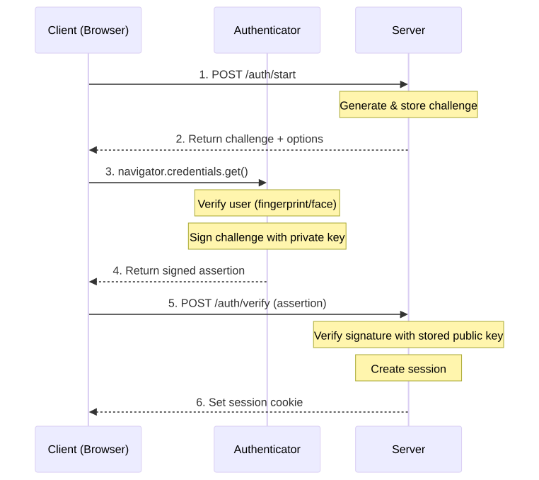
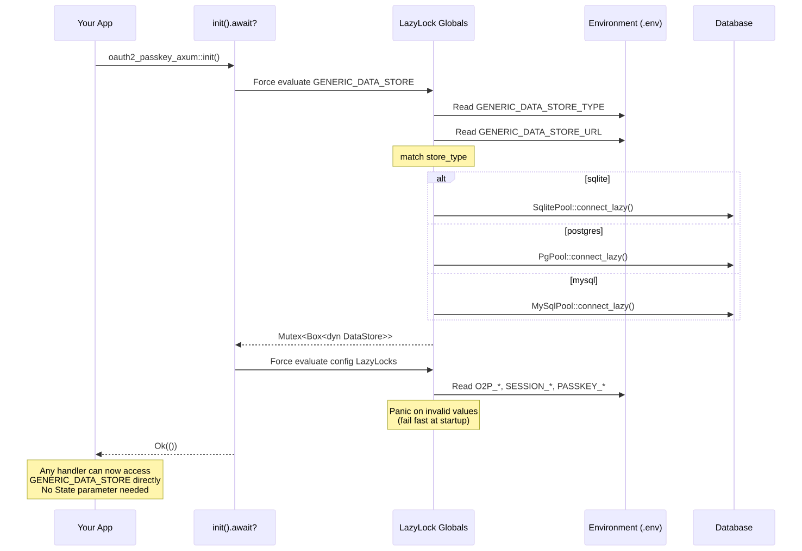

<!-- _class: lead -->

# oauth2-passkey

### Passwordless Authentication Library for Rust

**@ktaka** | Tokyo Rust Show & Tell | 2026/03/31

`crates.io/crates/oauth2-passkey`
`crates.io/crates/oauth2-passkey-axum`

---

<!-- _class: lead -->

# Live Demo

---

## Demo

<div class="with-qr">
<div>

- **Passkey Registration** - Create account with fingerprint/face
- **Passkey Login** - Authenticate without password
- **Google OAuth2 Login** - Sign in with Google
- **Account Linking** - Connect OAuth2 + Passkey to same user

</div>
<div style="text-align: center;">


passkey-demo.ccmp.jp

</div>
</div>

---

## What the Demo Showed

| Feature | Details |
|---------|---------|
| **OAuth2/OIDC** | Google login (also works with FedCM) |
| **Passkey** | Google Password Manager, Apple, Windows Hello, bitwarden, Proton Pass, YubiKey |
| **Account Linking** | OAuth2 + Passkey mapped to same user |
| **Session** | Cookie-based session with CSRF protection |

All handled by a single library: `oauth2-passkey`

---
## Motivation

I wanted to build **exactly what you just saw** - and do it myself in Rust.

- Existing Rust ecosystem:
  - `webauthn-rs` - WebAuthn only
  - Various OAuth2 crates - OAuth2 only
  - **No combined solution** with session management
- So I built one. Published on **crates.io**.

---

## Agenda

1. **How OAuth2 & Passkey Work** - What happened behind the demo
2. **Using the Library** - init, extractor, middleware
3. **Storage & LazyLock** - Multi-DB support, why not Axum State
4. **Integrating with Your App** - Linking your data to auth users
5. **Wrap-up** - Summary & links

---

## How OAuth2/OIDC Works

<div class="columns-60-40">
<div>


</div>
<div>

**Page-redirect based auth:**
1. User clicks "Login with Google"
2. Redirect to Google consent screen
3. Google returns authorization code
4. Server exchanges code for **id_token** (JWT)
5. Extract user info, create session
6. Set session cookie

</div>
</div>

---

## How Passkey/WebAuthn Works

<div class="columns-60-40">
<div>



</div>
<div>

**JavaScript-driven, no redirects:**
1. Server generates **challenge**
2. Browser calls `navigator.credentials.get()`
3. Authenticator signs challenge with **private key**
4. Server verifies with stored **public key**
5. Create session, set cookie

Authenticators: Google Password Manager, YubiKey, Touch ID, Windows Hello

</div>
</div>

---

<!-- _class: lead -->

# Using the Library

---

## Setup: init + merge

```rust
use oauth2_passkey_axum::{
    AuthUser, oauth2_passkey_full_router,
};

#[tokio::main]
async fn main() -> Result<(), Box<dyn std::error::Error>> {
    dotenv().ok();
    oauth2_passkey_axum::init().await?;       // 1. Initialize

    let app = Router::new()
        .route("/", get(index))
        .merge(oauth2_passkey_full_router()); // 2. Merge router

    // Auth endpoints are now at /o2p/*
    spawn_http_server(3001, app).await?;
    Ok(())
}
```

---

## Page Protection: AuthUser Extractor

```rust
// Required auth - redirects to login if not authenticated
async fn protected(user: AuthUser) -> impl IntoResponse {
    format!("Hello, {}!", user.label)
}

// Optional auth - allows anonymous access
async fn public(user: Option<AuthUser>) -> impl IntoResponse {
    match user {
        Some(u) => format!("Hello, {}!", u.label),
        None    => "Hello, anonymous!".to_string(),
    }
}
```

Implemented via Axum's `FromRequestParts` trait:
- `AuthUser` -> auto-redirect on failure
- `Option<AuthUser>` -> no redirect, `None` for anonymous

---

## Page Protection: Middleware

<div class="columns">
<div>

```rust
let app = Router::new()
    // Protect single route
    .route("/secret", get(handler)
        .route_layer(from_fn(
            is_authenticated_redirect)))
    // Protect entire group
    .nest("/api", api_router()
        .route_layer(from_fn(
            is_authenticated_user_redirect)));
```

</div>
<div>

| Middleware | Unauth | User? |
|-----------|--------|-------|
| `_401` | 401 | No |
| `_redirect` | Login | No |
| `_user_401` | 401 | Yes |
| `_user_redirect` | Login | Yes |

All prefixed with `is_authenticated`

</div>
</div>

---

<!-- _class: lead -->

# Storage & LazyLock Pattern

---

## Multi-DB Support with sqlx

<div class="columns">
<div>

**DataStore trait:**
```rust
pub(crate) trait DataStore: Send + Sync {
    fn as_sqlite(&self)
        -> Option<&Pool<Sqlite>>;
    fn as_postgres(&self)
        -> Option<&Pool<Postgres>>;
    fn as_mysql(&self)
        -> Option<&Pool<MySql>>;
}
```

One trait, three implementations.
No runtime downcasting needed.

</div>
<div>

**Dispatch pattern:**
```rust
let store = GENERIC_DATA_STORE
    .lock().await;

match (store.as_sqlite(),
       store.as_postgres(),
       store.as_mysql()) {
    (Some(pool), _, _) =>
        do_sqlite(pool).await?,
    (_, Some(pool), _) =>
        do_postgres(pool).await?,
    (_, _, Some(pool)) =>
        do_mysql(pool).await?,
    _ => return Err(...),
}
```

</div>
</div>

---

## Why LazyLock Instead of Axum State?

<div class="columns">
<div>

**Typical Axum State pattern:**
```rust
struct AppState { db: PgPool, cache: Redis }
let app = Router::new().with_state(state);

// EVERY handler needs State
async fn handler(
    State(s): State<AppState>
) { ... }

// 80+ internal functions need &AppState
async fn internal_fn(
    state: &AppState
) { ... }
```

</div>
<div>

**oauth2-passkey: LazyLock globals**
```rust
static GENERIC_DATA_STORE:
    LazyLock<Mutex<Box<dyn DataStore>>>
    = LazyLock::new(|| {
        match store_type {
            "sqlite"   => Box::new(...),
            "postgres" => Box::new(...),
            "mysql"    => Box::new(...),
        }
    });

// Any function can access directly
let store = GENERIC_DATA_STORE
    .lock().await;
```

</div>
</div>

---

## LazyLock: Benefits & Trade-offs

### Benefits
- **Zero boilerplate for users** - no `AppState` struct to create
- **No state threading** - internal functions access storage directly
- **Env-only config** - set `GENERIC_DATA_STORE_TYPE=postgres` in `.env`
- **Fail-fast init** - `init().await?` forces evaluation at startup

### Trade-offs
- Single instance per process (fine for auth library)
- Implicit dependencies (function signatures don't show DB access)
- Test isolation needs `#[serial]` (shared global state)

A library that requires users to manage `AppState` is harder to adopt.
LazyLock keeps complexity **inside** the library.

---

<!-- _class: lead -->

# Integrating with Your App

---

## Account Linking: Internal DB Structure

```
oauth2-passkey manages these tables:
┌──────────┐     ┌──────────────────┐     ┌─────────────────────┐
│  users   │────<│  oauth2_accounts │     │ passkey_credentials │
│          │────<│                  │     │                     │
│  id (PK) │     │  user_id (FK)    │     │ user_id (FK)        │
│  account │     │  provider        │     │ credential_id       │
│  label   │     │  provider_uid    │     │ public_key          │
└──────────┘     └──────────────────┘     └─────────────────────┘
       │
       │ user_id
       ▼
┌──────────────┐  ┌──────────┐
│user_profiles │  │  todos   │    <- Your app's tables
│  (1:1)       │  │  (1:N)   │
└──────────────┘  └──────────┘
```

One user can have multiple OAuth2 accounts AND multiple passkeys.

---

## Your App's Data: Link via AuthUser.id

<div class="columns">
<div>

**Setup: two databases, one app**
```rust
// 1. oauth2-passkey init
oauth2_passkey_axum::init().await?;

// 2. App's own DB
let pool = db::init_db().await?;
let state = AppState { pool };

// 3. Combine routes
let app = Router::new()
    .route("/", get(index))
    .merge(handlers::router())
    .with_state(state)
    .merge(oauth2_passkey_full_router());
```

</div>
<div>

**Handler: use user.id as FK**
```rust
async fn create_todo(
    State(state): State<AppState>,
    user: AuthUser,
    Form(form): Form<TodoForm>,
) -> Result<Response, ...> {
    db::create_todo(
        &state.pool,
        &user.id,  // link to auth user
        &form.title,
    ).await?;
    Ok(Redirect::to("/").into_response())
}
```

See `demo-profile` (1:1) and `demo-todo` (1:N).

</div>
</div>

---

<!-- _class: lead -->

# Wrap-up

---

## Summary

<div class="with-qr">
<div>

| What | Details |
|------|---------|
| **Library** | `oauth2-passkey` + `oauth2-passkey-axum` |
| **What it does** | Passkey + OAuth2 auth for Axum apps |
| **DB support** | SQLite, PostgreSQL, MySQL (via sqlx) |
| **Key design** | LazyLock globals, DataStore trait dispatch |
| **Integration** | `AuthUser.id` links your app data to auth |

### Links
- **crates.io**: `oauth2-passkey`, `oauth2-passkey-axum`
- **GitHub**: github.com/ktaka-ccmp/oauth2-passkey
- **X**: @ktaka

</div>
<div style="text-align: center;">


GitHub

</div>
</div>

---

<!-- _class: lead -->

# Thank You!

### Questions?

**@ktaka** on X / GitHub

---

## About Me

<div class="with-qr">
<div>

- **@ktaka** (X / GitHub)
- Self-employed, reskilling in Rust
- Building web authentication libraries
- Third year writing Rust

</div>
<div style="text-align: center;">


ktaka.blog.ccmp.jp/p/p.html

</div>
</div>

---

<!-- _class: lead -->

# Extra Slides

---

## Newtype Wrappers: Type Safety

<div class="columns">
<div>

```rust
pub struct CsrfToken(String);
pub struct UserId(String);
pub struct SessionId(String);
pub struct SessionCookie(String);
pub struct CsrfHeaderVerified(pub bool);
pub struct AuthenticationStatus(pub bool);
```

</div>
<div>

```rust
// Without newtypes - compiles but wrong!
fn check(session_id: &str, user_id: &str);
check(user_id, session_id); // Oops!

// With newtypes - compile error!
fn check(session_id: SessionId,
         user_id: UserId);
check(user_id, session_id); // Error!
```

</div>
</div>

Prevent mixing up strings/bools at compile time.

---

## Newtype Wrappers: Validation in Constructors

```rust
impl UserId {
    pub fn new(id: String) -> Result<Self, SessionError> {
        if id.is_empty() {
            return Err(SessionError::Validation("User ID cannot be empty".into()));
        }
        if id.len() > 255 {
            return Err(SessionError::Validation("User ID too long".into()));
        }
        if !id.chars().all(|c| c.is_ascii_alphanumeric()
            || matches!(c, '-' | '_' | '.' | '@' | '+')) {
            return Err(SessionError::Validation("Invalid characters".into()));
        }
        Ok(UserId(id))
    }
}
```

**If you have a `UserId`, it's guaranteed valid.** No need to re-validate.

---

## Error Hierarchy with thiserror

```rust
#[derive(Error, Debug)]
pub enum CoordinationError {
    #[error("Unauthorized access")]
    Unauthorized,
    #[error("Resource not found: {resource_type} {resource_id}")]
    ResourceNotFound { resource_type: String, resource_id: String },

    // Wrap module-specific errors
    #[error("OAuth2 error: {0}")]   OAuth2Error(OAuth2Error),
    #[error("Passkey error: {0}")]  PasskeyError(PasskeyError),
    #[error("Session error: {0}")]  SessionError(SessionError),
    #[error("User error: {0}")]     UserError(UserError),
}
```

Each module has its own error type. The coordination layer wraps them all.

---

## From Impls with Auto-Logging

<div class="columns">
<div>

```rust
impl From<OAuth2Error>
    for CoordinationError
{
    fn from(err: OAuth2Error) -> Self {
        let error = Self::OAuth2Error(err);
        tracing::error!("{}", error);
        error  // Auto-log on conversion!
    }
}
```

</div>
<div>

Every `?` that crosses a module boundary automatically logs:

```rust
// ? triggers From impl + logging
let token = exchange_code(code)
    .await?; // OAuth2Error -> logged
let user = get_user(id)
    .await?; // UserError -> logged
```

No manual `tracing::error!()` needed.

</div>
</div>

---

## Security: Constant-Time Comparison

<div class="columns">
<div>

```rust
use subtle::ConstantTimeEq;

// CSRF token verification
if header_csrf_token
    .as_bytes()
    .ct_eq(session_csrf_token
        .as_str().as_bytes())
    .into()
{
    // Token matches
}
```

</div>
<div>

**Why not just `==`?**

- Regular `==` short-circuits on first mismatch
- Attacker measures response time to guess bytes
- `ct_eq` always takes the same time

Used for CSRF tokens, session validation, and other security-sensitive comparisons.

</div>
</div>

---

## Atomic SQL: No Explicit Transactions

```rust
// "Delete user, but only if they're not the last admin"
// Done in a SINGLE SQL statement - no transaction needed

pub async fn delete_user_if_not_last_admin_postgres(
    pool: &Pool<Postgres>, id: UserId,
) -> Result<bool, UserError> {
    let result = sqlx::query(&format!(
        r#"DELETE FROM {table}
           WHERE id = $1
           AND (SELECT COUNT(*) FROM {table}
                WHERE is_admin = true) > 1"#
    ))
    .bind(id.as_str())
    .execute(pool).await?;

    Ok(result.rows_affected() > 0)
}
```

Business logic **in SQL** = atomic by default. No race conditions.

---

## SQL Dialect Differences

<div class="columns">
<div>

**PostgreSQL** - one query
```rust
sqlx::query_as::<_, User>(&format!(
    "INSERT INTO {table} (...)
     VALUES ($1, $2, ...)
     ON CONFLICT (id) DO UPDATE SET ...
     RETURNING *"
)).fetch_one(pool).await
```

</div>
<div>

**SQLite** - need two queries
```rust
sqlx::query(&format!(
    "INSERT INTO {table} (...)
     VALUES (?, ?, ...)
     ON CONFLICT (id) DO UPDATE SET ..."
)).execute(pool).await?;

sqlx::query_as::<_, User>(&format!(
    "SELECT * FROM {table} WHERE id = ?"
)).fetch_one(pool).await
```

</div>
</div>

Supporting 3 databases means handling these quirks per-backend.

---

## LazyLock Initialization Flow

<div class="columns-60-40">
<div>



</div>
<div>

**Startup sequence:**
1. App calls `init().await?`
2. Forces all `LazyLock` globals to evaluate
3. Reads env vars (`DB_TYPE`, `DB_URL`, ...)
4. Creates appropriate connection pool
5. Panics on invalid config (fail-fast)

After init, any internal function can access `GENERIC_DATA_STORE` directly - no state parameter needed.

</div>
</div>

---

## Crate Structure (Detail)



---

## From/Into: Clean Layer Boundaries

<div class="columns">
<div>

```rust
// DB layer -> Session layer
impl From<DbUser> for SessionUser {
    fn from(db_user: DbUser) -> Self {
        Self {
            id: db_user.id,
            account: db_user.account,
            label: db_user.label,
            is_admin: db_user.is_admin,
            ..
        }
    }
}
```

</div>
<div>

```rust
// Session -> Axum layer
impl From<SessionUser> for AuthUser {
    fn from(su: SessionUser) -> Self {
        AuthUser {
            id: su.id,
            // ... copy fields
            csrf_token: String::new(),
            session_id: String::new(),
            // ^ Axum-specific fields
        }
    }
}
```

</div>
</div>

Each layer has its own type. `From` impls make conversion seamless with `into()`.

---

## Future Plans

- **DPoP (Demonstration of Proof-of-Possession)**
  - Bind tokens to a cryptographic key
  - Prevent token theft/replay
- **Bearer Token support**
  - API authentication beyond session cookies
- **FedCM (Federated Credential Management)**
  - Browser-native identity UI (experimental, already partially implemented)
- **More OAuth2 providers**
  - GitHub, Apple, Microsoft, etc.
